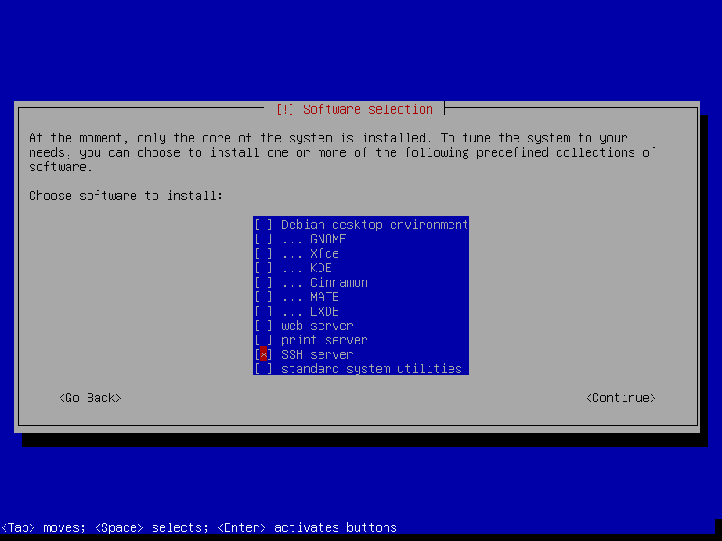

|   |   |
|---|---|
| [W3PMU](https://github.com/ajstadlin/W3PMU) | [Exercises](https://github.com/ajstadlin/W3PmuExercises) |

***This document is an exercise procedure for setting up and testing concepts.***

# Debian Jessie with LXDE and Mono

This is a *cookbook recipe* style exercise procedure for setting up a Debian Jessie virtual machine with LXDE and Mono. This procedure was developed and tested using specified operating systems, software versions, and installation sequence. However, with appropriate modifications, this procedure should be adaptable to work in other hardware and software platforms.

- [Platform](#platform)
    - [Platform Description](#platform-description)
    - [Platform Configuration](#platform-configuration)
        - [`W3PMU-VBOX` VirtualBox Host Server](#w3pmu-vbox-virtualbox-host-server)
        - [`W3PMU-DEBLM` Debian Virtual Machine](#w3pmu-deblm-debian-virtual-machine)
    - [Host Server Setup](#host-server-setup)
        - [DNS Configuration](#dns-configuration)
        - [Virtual Machine Setup](#virtual-machine-setup)
- [`W3PMU-DEBLM` Virtual Machine Initial Setup](#w3pmu-deblm-virtual-machine-initial-setup)
    - [`W3PMU-DEBLM` Configuration](#w3pmu-deblm-configuration)
- [`W3PMU-DEBLM` Software and Utilities Installation](#w3pmu-deblm-software-and-utilities-installation)
    - [Git](#git)
    - [NTP](#ntp)
    - [Python](#python)
    - [Mono](#mono)
        - [Install Mono from the Mono Project Debian Packages](#install-mono-from-the-mono-project-debian-packages)
        - [Build Mono from a release tarball](#build-mono-from-a-release-tarball)
- [`W3PMU-DEBLM` X11 and LXDE Installation](#w3pmu-deblm-x11-and-lxde-installation)
	- [Install Optional Utility Software](#install-optional-utility-software)
	- [Disable Console Screen Blanking](#disable-console-screen-blanking)
	- [XSet Keyboard Repeat Rate](#xset-keyboard-repeat-rate)
	
---

## Platform

### Platform Description

This example uses a physical Host Server named [`W3PMU-VBOX`](#w3pmu-vbox-virtualbox-host-host-server) running Windows and VirtualBox to host virtual machines configured with various operating systems and software.

The virtual machines are created with a clean operating system and software installations. This document tries to highlight the non-default customized installation steps and settings. This document does not include many *default* installation steps and settings.

### Platform Configuration

#### `W3PMU-VBOX` VirtualBox Host Server
    - Windows 10 Enterprise 2016 LTSB with Oracle VirtualBox 5.1.12 for hosting virtual machines
    - Software = [Oracle VirtualBox](http://www.virtualbox.org)
    - CPU = Intel i7, 2.8GHz, Laptop
    - RAM = 16GB, 2133 MHz, non-ECC
    - WiFi Ethernet with Internet access

#### `W3PMU-DEBLM` Debian Virtual Machine
    - OS = Debian Jessie 8.7.1 amd64 from netinst.iso 
    - Software = [mono](http://www.mono-project.com/)
    - CPU = 3 virtual cores
    - RAM = 3072 MB
	- Video Memory = 128 MB
    - VHD = 64 GB virtual hard drive
	- Network Adapter = Bridged Adapter
	- Do Not Set the *Hardware Clock in UTC Time* option
	
---

### Host Server Setup

In this example, the *Host Server* is a general purpose physical laptop whose function is to provide a VirtualBox infrastructure to run the virtual machines. Setting up the *Host Server* is beyond the scope of this example. However, the only significant *Host Server* setup beyond a clean Windows install is the simple installation of [Oracle VirtualBox](http://www.virtualbox.org) software.

#### DNS Configuration

This exercise will use each machine's **hosts** file for DNS Host Name to IP Address resolution. The *Host Server* will keep its current *DHCP dynamic IP Address* and the virtual machines will use *static IPv4 addresses*.

This example's local area network (LAN) IP Address range is `192.168.1.0 to 192.168.1.255`. Your network will not likely use the same IP Addresses. Also the `w3pmu.com` domain name is arbitrary. If using a different domain name, make sure it does not conflict with a *real Internet domain* you may want to access. 

Do the following on the *Host Server*:

1. Open a *Command Prompt* as Administrator
2. Run `ipconfig /all`
	- Record the IPv4 Address.
	- Record the Default Gateway  
	- Record the DNS Server's IP Address
3. Run `ping 192.168.1.142` to test the IPv4 Address we will be assigning to the `W3PMU-DEBLM` virtual machine
    - Run `arp -a` to verify that 192.168.1.142 is not being used by any other MAC addresses.
    - If 192.168.1.142 is listed in the `arp -a` list, then pick a different IP address and test again
4. Run `notepad C:\Windows\system32\drivers\etc\hosts` and add the following entries
    - `192.168.1.140     w3pmu-vbox.w3pmu.com`
    - `192.168.1.140     W3PMU-VBOX`
    - `192.168.1.142     w3pmu-deblm.w3pmu.com`
    - `192.168.1.142     W3PMU-DEBLM`
5. Run `ipconfig /flushdns` to clear the local DNS cache
6. Run `ping w3pmu-vbox.w3pmu.com` to make sure the new *hosts* file changes are in effect

#### Virtual Machine Setup

This example uses a minimal installation with [Debian 8.7.1 netinst.iso for amd64](http://mirrors.kernel.org/debian-cd/8.7.1/amd64/iso-cd/debian-8.7.1-amd64-netinst.iso) from [Mirrors.Kernel.org](http://mirrors.kernel.org).

---

## `W3PMU-DEBLM` Virtual Machine Initial Setup

1. Download the `debian-8.7.1-amd64-netinst.iso` file to the [`W3PMU-VBOX`](#w3pmu-vbox-virtualbox-host-server) server
2. On the [`W3PMU-VBOX`](#w3pmu-vbox-virtualbox-host-server) server: create the [`W3PMU-DEBLM`](#w3pmu-deblm-debian-virtual-machine) virtual machine
    - Configure [`W3PMU-DEBLM`](#w3pmu-deblm-debian-virtual-machine) VirtualBox *Settings* as described in the earlier [Platform Configuration](#platform-configuration) section and assign the `debian-8.7.1-amd64-netinst.iso` image file to its DVD drive.
3. Start the `W3PMU-DEBLM` virtual machine and run the Debian installation. 
	- In the *Configure the network / Please enter the hostname* dialog, set the *Hostname* to `w3pmu-deblm` then press the *Enter* key to *Continue*
	- In the *Configure the network / Domain Name* dialog, set the *Domain name* to `w3pmu.com` then press the *Enter* key to *Continue*
	- When prompted to enter Passwords, do not use symbols in common with SQL or shell scripting
	- Continue with disk setup stuff and *Installing the base system*
	- Continue with selecting a download mirror and *Configuring apt*
	- In the *Software selection* dialog, Only select *SSH server* and un-select everything else
		- []()
	- Continue and complete the remaining installation
	- Reboot

### `W3PMU-DEBLM` Configuration

- 1. Login with the User account created during initial setup
- 2. Run `su` and enter the `root` account password
- 3. Run the following maintenance commands. Replace `<your_username>` with the User account created during initial setup.

```
apt-get update
apt-get dist-upgrade
apt-get install sudo
adduser <your_username> sudo
reboot
```

- 4. Login with the User account
	- Run `sudo ifconfig -a` and enter the root password to elevate privileges and execute the command
	- Make note of the Ethernet interface. It is probably `eth0`
- 5. Configure the static IP Address using *nano* or other Debian text editor. Your IPv4 network addressing is probably different

```sh
$ sudo nano /etc/network/interfaces
    ... 
    allow-hotplug eth0
    iface eth0 inet static
    address 192.168.1.142
    netmask 255.255.255.0
    gateway 192.168.1.1
    broadcast 192.168.1.255
    network 192.168.1.0
    dns-nameservers 192.168.1.249

$ sudo nano /etc/resolv.conf
	nameserver 192.168.1.249

$ reboot
```

- 6. *Ping* stuff to test the network and DNS configuration.

---

## `W3PMU-DEBLM` Software and Utilities Installation

Now that the base Debian operating system is installed and the machine has an IP address, it is probably easier to access the `W3PMU-DEBLM` machine using an **ssh** client that allows copy/paste clipboard. If you are running VirtualBox on a Windows *Host Server* as described for this exercise's `W3PMU-VBOX` laptop, then using Git's MINGW bash shell has a nice **ssh** console. In the Git console, simply run `ssh <your_username>@w3pmu-deblm`

### Git

Building *Git* is not really required to install and run *openPDC*, however, downloading and building the latest version of *Git* is a good way to install some prerequisites we need later to build *openPDC*

```sh
# Install Git prerequisites
sudo apt-get install ca-certificates xz-utils -y
sudo apt-get install build-essential gettext libssl-dev libcurl4-openssl-dev libexpat1-dev tk-dev asciidoc docbook2x unzip -y
# Change to Home folder
cd ~
# Get git
wget https://www.kernel.org/pub/software/scm/git/git-2.12.2.tar.gz 
tar -xzvf git-2.12.2.tar.gz
cd git-2.12.2
# Make Git and Install 
make prefix=/usr/local all doc info
sudo make prefix=/usr/local install all install-doc install-html install-info
# Test Git
git –version
```

### NTP

Network Time Protocol *NTP* is used to synchronize the computer's time clock with reference time server.

- Reference: [Install and Configure NTP in Debian](http://www.tecmint.com/install-and-configure-ntp-server-client-in-debian/)
- Reference: [NIST Internet Time Servers](http://tf.nist.gov/tf-cgi/servers.cgi)

```sh
# Install NTP
sudo apt-get install ntp
# Optionally modify the time servers and other ntp options
sudn nano /etc/ntp.conf
# Apply configuration changes
sudo dpkg-reconfigure ntp
# Check
sudo ntpd --version
sudo ntpq -p
sudo service ntp status
```

### Python

Python might be required for properly building or testing mono

```sh
# Python 2
cd ~/
wget https://www.python.org/ftp/python/2.7.13/Python-2.7.13.tar.xz
tar -xvf Python-2.7.13.tar.xz
cd Python-2.7.13
./configure
make
sudo make install
python2 --version
# Python 3
cd ~/
wget https://www.python.org/ftp/python/3.6.1/Python-3.6.1.tar.xz 
tar -xvf Python-3.6.1.tar.xz
cd Python-3.6.1
./configure
make
sudo make install
python3 --version
```

### Mono

#### Install Mono from the Mono Project Debian Packages

- Use this procedure if you are planning to install [MonoDevelop](http://www.monodevelop.com/)
- Reference: [Install for Debian, Ubuntu, and derivatives](http://www.mono-project.com/docs/getting-started/install/linux/#debian-ubuntu-and-derivatives)

```sh
sudo apt-key adv --keyserver hkp://keyserver.ubuntu.com:80 --recv-keys 3FA7E0328081BFF6A14DA29AA6A19B38D3D831EF
echo "deb http://download.mono-project.com/repo/debian wheezy main" | sudo tee /etc/apt/sources.list.d/mono-xamarin.list
echo "deb http://download.mono-project.com/repo/debian wheezy-apache24-compat main" | sudo tee -a /etc/apt/sources.list.d/mono-xamarin.list
echo "deb http://download.mono-project.com/repo/debian wheezy-libjpeg62-compat main" | sudo tee -a /etc/apt/sources.list.d/mono-xamarin.list
sudo apt-get update
sudo apt-get upgrade
sudo apt-get install mono-devel -y
sudo apt-get install mono-complete -y
sudo apt-get install referenceassemblies-pcl -y
sudo apt-get install ca-certificates-mono
# sudo apt-get install mono-xsp4
```

#### Build Mono from a release tarball

- This is an alternative to installing from a Debian package

```sh
# Install dependencies.  
sudo apt-get install build-essential gettext libtool automake cmake -y
sudo apt-get install mono-devel -y

# Download the source code tarball file and extract and build it
cd ~
wget http://download.mono-project.com/sources/mono/mono-4.8.0.382.tar.bz2
tar -xvjf mono-4.8.0.382.tar.bz2
cd mono-4.8.0
./configure --prefix=/usr/local
make
sudo make install
sudo reboot
mono --version
```

---

## `W3PMU-DEBLM` X11 and LXDE Installation

GUI installation instructions are derived from the procedure described in: [GUIDE Raspbian Lite with LXDE/XFCE/MATE/Openbox GUI](https://www.raspberrypi.org/forums/viewtopic.php?f=66&t=133691)

```
sudo apt-get update
sudo apt-get upgrade
sudo apt-get dist-upgrade

sudo apt-get install xserver-xorg 
sudo apt-get install xinit x11-xserver-utils xorg 
# Raspbian Jan 11, 2017 physical mouse and keyboard no longer working
sudo apt-get install xserver-xorg-input-evdev
sudo reboot

sudo apt-get update
sudo apt-get upgrade
sudo apt-get dist-upgrade

# Raspbian PIXEL instead of LXDE
# sudo apt-get install rpi-update
# sudo rpi-update
# sudo apt-get install raspberrypi-ui-mods

sudo apt-get install lxde-core --fix-missing
sudo reboot
... login ...
startx

sudo apt-get install lightdm
sudo nano /etc/lightdm/lightdm.conf
	autologin-user=pi
	autologin-user-timeout=0
sudo dpkg-reconfigure lightdm
```

### Install Optional Utility Software

```
sudo apt-get install htop ntpdate freerdp-x11 x11vnc lxterminal leafpad clipit -y
sudo reboot
```

### Disable Console Screen Blanking

```
sudo nano /etc/X11/xorg.conf
Section "Monitor"
    Identifier "Monitor"
    Option "DPMS" "false"
EndSection
Section "ServerLayout"
    Identifier "ServerLayout0"
    Option "BlankTime"  "0"
    Option "StandbyTime" "0"
    Option "SuspendTime" "0"
    Option "OffTime" "0"
EndSection

sudo mkdir /etc/kbd
sudo nano /etc/kbd/config
BLANK_TIME=0
BLANK_DPMS=off
POWERDOWN_TIME=0

sudo nano /etc/rc.local
setterm -blank 0 -powersave off -powerdown 0
setterm -blank 0 -powersave off -powerdown 0 >/dev/console
```

### XSet Keyboard Repeat Rate

```sh
# I like it a bit faster than default
sudo xset r rate 180 40
```

---

Mar 28, 2017 - Updated by [aj](https://github.com/ajstadlin)  
Jan 2, 2017 - Created by [aj](https://github.com/ajstadlin)

---

[MIT License](../LICENSE)

